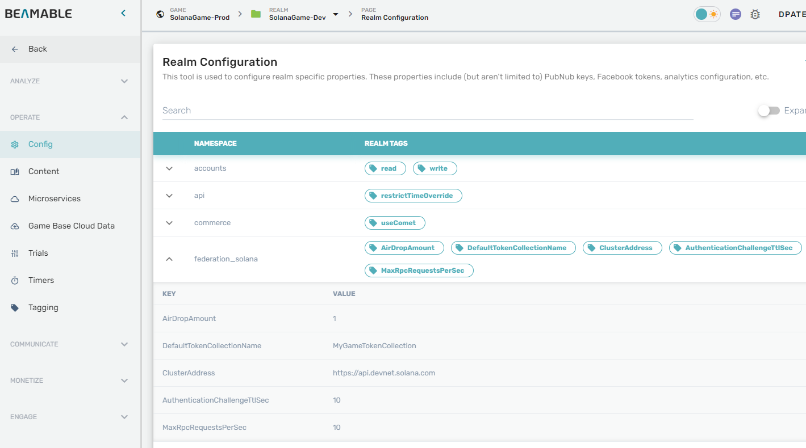

# Beamable Solana Sample

Welcome to the Beamable Solana Sample project! This is a Unity project that demonstrates how 
to integrate the [Solana](https://solana.com/) blockchain into a [Beamable](https://beamable.com/) 
powered game.

#[Full Documentation.](https://docs.beamable.com/docs/solana-integration)

## Getting Started

Before getting started, please head to [Beamable](https://beamable.com/) and sign up. 
You will also need to setup a [Solana](https://solana.com/) development environment.
You should have the following tools installed on your development machine.

1. [Unity 2021](https://unity.com/download)
2. [Docker](https://www.docker.com/products/docker-desktop/)
3. [Net6](https://dotnet.microsoft.com/en-us/download/dotnet/6.0)
4. [Git](https://git-scm.com/downloads)

### Sample Project
To get started with this sample project, use `git` to clone this project, and open it
with Unity 2021. 

### Importing Into Your Project
The Solana integration is portable to other Beamable Unity projects. The Microservice and 
Microstorage code be imported into a target project. The best way is to use Unity Package Manager
and add a part of this repository as an external package. 

**Before doing this, please ensure that the target project already has Beamable installed** 

In the Unity Package Manager, [add a package via git-link](https://docs.unity3d.com/Manual/upm-ui-giturl.html).
for `com.beamable.solana` and use the following git-link.
```shell
https://github.com/beamable/solana-example.git?path=/Packages/com.beamable.solana#1.0.0
```

Note: the end of the link includes the version number. You view the available versions by looking
at this repositories git tags. 

## Configuration
Configuration defaults are hard-coded inside **Runtime/SolanaFederation/Configuration.cs**  
You can override the values using the realm configuration.  


**Default values:**  

| **Namespace**     | **Key**                       | **Default value**             | **Description**                                                               |
|-------------------|-------------------------------|-------------------------------|-------------------------------------------------------------------------------|
| federation_solana | ClusterAddress                | https://api.devnet.solana.com | Cluster RPC API URI                                                           |
| federation_solana | DefaultTokenCollectionName    | Beamable                      | Name for the default NFT collection                                           |
| federation_solana | MaxRpcRequestsPerSec          | 6                             | RPC client throttling configuration (to stay below the limits on public APIs) |
| federation_solana | AuthenticationChallengeTtlSec | 600                           | Authentication challenge TTL                                                  |
| federation_solana | AirDropAmount                 | 1                             | If > 0, service will request an airdrop to the realm wallet after creation    |

**IMPORTANT:** Configuration is loaded when the service starts. Any configuration change requires a service restart.
